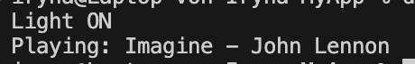

# Interface-segregation-principle

Принцип розділення інтерфейсів - краще кілька маленьких інтерфейсів, ніж один великий.

Як працює код:
- Є два інтерфейси: ILightControl (керування світлом) і IMusicControl (музика).
- SmartLamp реалізує тільки світло.
- SmartSpeaker реалізує тільки музику.

Тобто класи реалізують тільки ті інтерфейси, які їм потрібні. Ніхто не змушений реалізовувати зайве (наприклад, лампа не повинна мати метод PlayMusic).
## Код
```csharp
using System;

interface ILightControl
{
    void SwitchLight(bool on);
}

interface IMusicControl
{
    void PlayMusic(string track);
}

class SmartLamp : ILightControl
{
    public void SwitchLight(bool on) =>
        Console.WriteLine(on ? "Light ON" : "Light OFF");
}

class SmartSpeaker : IMusicControl
{
    public void PlayMusic(string track) =>
        Console.WriteLine($"Playing: {track}");
}

class Program
{
    static void Main()
    {
        ILightControl lamp = new SmartLamp();
        IMusicControl speaker = new SmartSpeaker();

        lamp.SwitchLight(true);
        speaker.PlayMusic("Imagine - John Lennon");
    }
}
```

## Результат

